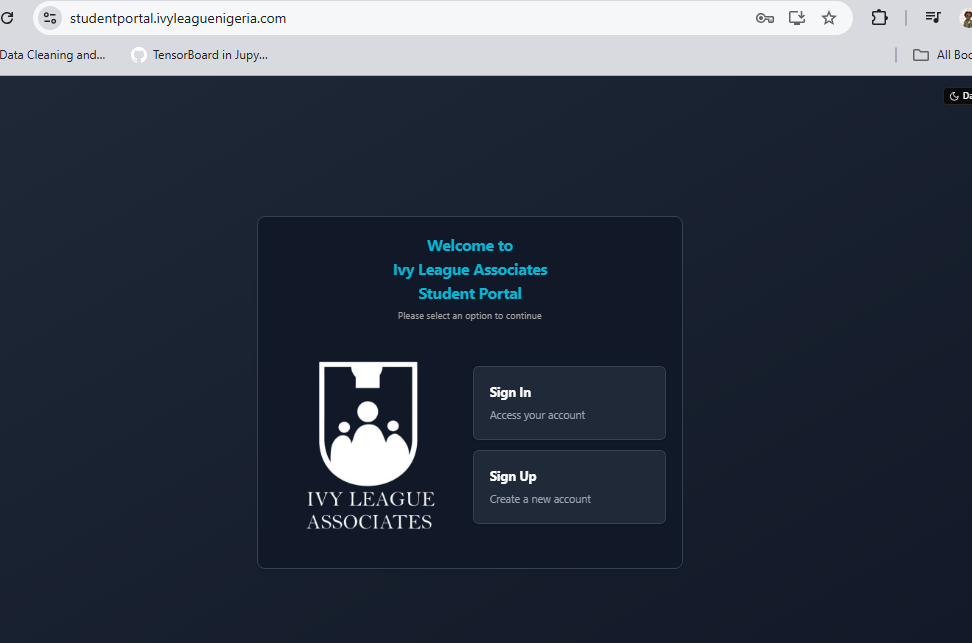

# Issues
## Very urgent fixes
- Placeholders should be faded, they look like regular text and it is confusing.
- I signed in and was directed to the page below:

- Tried to verify email by clicking on the link, instead of it to tell me the email is verified it asked me to put the email in. 
- After putting the email in and clicking verify email it did nothing, just reloaded and asked me to put the email agian, except this time, i can't type. and although i can't type the text is still there
- As a result **Email verificationn is not working.**

## Less urgent fixes
- The system says `you are signed in, click to go to dashboard.` But we should just take them there directly.
- Sign in persistence (Almost forgot this)
- Ping backend thing (Almost forgot this)
